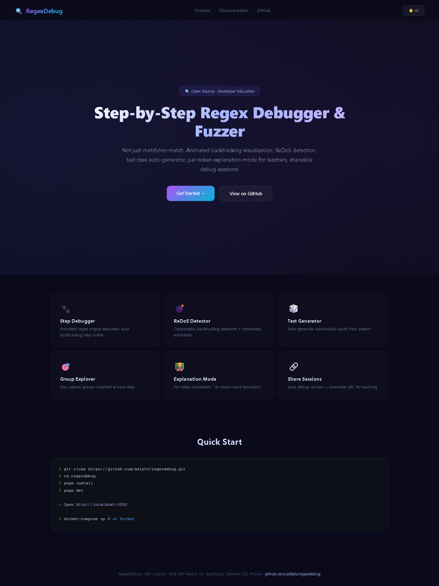

<div align="center">

# 🔍 RegexDebug

### Step-by-Step Regex Debugger & Fuzzer

[](https://nextjs.org/)
[](https://www.typescriptlang.org/)
[](https://tailwindcss.com/)
[](https://www.prisma.io/)
[](https://opensource.org/licenses/MIT)
[](https://vitest.dev/)

Debug regular expressions step-by-step, detect ReDoS vulnerabilities, generate test cases, and share sessions. A powerful regex playground for developers.

</div>

---

## ✨ Features

- **🔬 Step Debugging** — Watch your regex execute step-by-step with animated visualization
- **🛡️ ReDoS Detection** — Automatically detect catastrophic backtracking patterns and estimate worst-case complexity (O(n) → O(2ⁿ))
- **🧪 Test Generator** — Auto-generate valid and invalid test cases from your regex pattern
- **📊 Capture Group Explorer** — Visualize all capture groups with positions and named group highlighting
- **📖 Explanation Mode** — Per-token annotation panel explaining what each part of your regex does
- **🔗 Shareable Sessions** — Save debug sessions to database and share via URL
- **📈 Performance Graph** — Benchmark regex execution time across different input sizes
- **📋 Cheatsheet Sidebar** — Common regex patterns (email, URL, phone, IP, date, etc.) with quick reference
- **🎨 Beautiful UI** — Glassmorphism design with gradients, animations, and dark/light themes

## 📸 Screenshots

| Landing Page | Dashboard |
|:---:|:---:|
|  |  |

> 💡 *Run locally to see the full interactive experience: `pnpm dev` then open http://localhost:3000*


## 🛠️ Tech Stack

| Category | Technology |
|----------|-----------|
| Framework | Next.js 14 (App Router) |
| Language | TypeScript |
| Styling | Tailwind CSS + shadcn/ui |
| Editor | Monaco Editor |
| Database | Prisma + SQLite |
| Animation | Framer Motion |
| Validation | Zod |
| Testing | Vitest + Playwright |
| Containerization | Docker + Docker Compose |

## 🚀 Quick Start

### Prerequisites

- Node.js 18+
- npm or yarn

### Installation

```bash
# Clone the repository
git clone https://github.com/yourusername/regexdebug.git
cd regexdebug

# Install dependencies
npm install

# Set up environment variables
cp .env.example .env

# Initialize database
npx prisma db push

# Run development server
npm run dev
```

Open [http://localhost:3000](http://localhost:3000) in your browser.

### Docker

```bash
# Build and run with Docker Compose
docker-compose up -d
```

## 📐 Architecture

```
┌─────────────────────────────────────────────────────────┐
│                    Browser (Client)                      │
│  ┌──────────┐ ┌──────────┐ ┌──────────┐ ┌──────────┐  │
│  │  Hero /  │ │  Regex   │ │   Step   │ │  ReDoS   │  │
│  │ Landing  │ │ Editor   │ │ Debugger │ │ Detector │  │
│  └──────────┘ └──────────┘ └──────────┘ └──────────┘  │
│  ┌──────────┐ ┌──────────┐ ┌──────────┐ ┌──────────┐  │
│  │   Test   │ │ Capture  │ │Explainer │ │Perf Graph│  │
│  │Generator │ │ Explorer │ │  Panel   │ │          │  │
│  └──────────┘ └──────────┘ └──────────┘ └──────────┘  │
└─────────────────────────┬───────────────────────────────┘
                          │ HTTP API
┌─────────────────────────┴───────────────────────────────┐
│              Next.js API Routes (Server)                 │
│  ┌────────┐ ┌──────────┐ ┌─────────┐ ┌──────────┐      │
│  │/debug  │ │/redos-   │ │/generate│ │ /explain │      │
│  │  POST  │ │check POST│ │-tests   │ │   POST   │      │
│  └────────┘ └──────────┘ └─────────┘ └──────────┘      │
│  ┌────────┐ ┌──────────┐ ┌─────────┐                    │
│  │/sessions│ │/sessions │ │/health  │                    │
│  │GET/POST│ │  /[id]   │ │   GET   │                    │
│  └────────┘ └──────────┘ └─────────┘                    │
│                                                         │
│  ┌──────────────────────────────────────┐              │
│  │       Security Layer                 │              │
│  │  Zod Validation • Rate Limiting     │              │
│  │  ReDoS Protection • Input Sanitizing │              │
│  └──────────────────────────────────────┘              │
└─────────────────────────┬───────────────────────────────┘
                          │ Prisma ORM
┌─────────────────────────┴───────────────────────────────┐
│                   SQLite Database                       │
│  ┌──────────────┐  ┌─────────────────┐                 │
│  │   Session    │  │ ShareableLink   │                 │
│  ├──────────────┤  ├─────────────────┤                 │
│  │ id           │  │ id              │                 │
│  │ name         │  │ sessionId (FK)  │                 │
│  │ pattern      │  │ token           │                 │
│  │ testString   │  │ expiresAt       │                 │
│  │ engine       │  │ createdAt       │                 │
│  │ steps (JSON) │  └─────────────────┘                 │
│  │ captures     │                                      │
│  │ redosWarning │                                      │
│  │ complexity   │                                      │
│  │ createdAt    │                                      │
│  └──────────────┘                                      │
└─────────────────────────────────────────────────────────┘
```

## 📡 API Documentation

### `POST /api/debug`
Execute a regex pattern with step tracking.

**Request:**
```json
{
  "pattern": "\\d+",
  "testString": "hello 123 world",
  "flags": "g",
  "engine": "javascript"
}
```

**Response:** `200 OK`
```json
{
  "steps": [...],
  "matches": [{ "match": "123", "index": 6, "groups": [] }],
  "totalSteps": 15,
  "executionTime": 0.45,
  "redosWarning": false,
  "complexity": "O(n)"
}
```

### `POST /api/redos-check`
Check a pattern for ReDoS vulnerabilities.

**Request:** `{ "pattern": "(a+)+" }`
**Response:** `{ "isVulnerable": true, "complexity": "O(2ⁿ)", "patterns": [...], "suggestions": [...] }`

### `POST /api/generate-tests`
Generate test cases from a pattern.

**Request:** `{ "pattern": "\\d{3}", "count": 5 }`
**Response:** `{ "tests": [{ "input": "123", "shouldMatch": true, "actualMatch": true, "matchValue": "123" }] }`

### `POST /api/explain`
Get per-token explanation of a regex pattern.

**Request:** `{ "pattern": "\\d+" }`
**Response:** `{ "tokens": [{ "token": "\\d", "type": "escape", "description": "Matches any digit (0-9)" }] }`

### `GET /api/sessions`
List all saved debug sessions.

### `POST /api/sessions`
Create a new debug session.

### `GET /api/sessions/:id`
Get a specific session by ID.

### `DELETE /api/sessions/:id`
Delete a session.

### `GET /api/sessions/:id/share`
Create or retrieve a shareable link for a session.

### `GET /api/health`
Health check endpoint.

## 📖 Regex Reference Guide

| Token | Description | Example |
|-------|-------------|---------|
| `.` | Any character | `a.c` → `abc`, `a1c` |
| `\d` | Digit (0-9) | `\d+` → `123` |
| `\w` | Word char (a-z, A-Z, 0-9, _) | `\w+` → `hello_1` |
| `\s` | Whitespace | `\s+` → ` ` |
| `\b` | Word boundary | `\bword\b` |
| `^` | Start of string | `^Hello` |
| `$` | End of string | `world$` |
| `*` | 0 or more | `a*` |
| `+` | 1 or more | `a+` |
| `?` | 0 or 1 | `colou?r` |
| `{n}` | Exactly n | `\d{3}` |
| `{n,m}` | n to m | `\d{2,4}` |
| `[abc]` | Character class | `[aeiou]` |
| `[^abc]` | Negated class | `[^0-9]` |
| `(abc)` | Capture group | `(\d+)-(\d+)` |
| `(?:...)` | Non-capturing | `(?:abc)+` |
| `(?=...)` | Lookahead | `a(?=b)` |
| `(?<=...)` | Lookbehind | `(?<=a)b` |
| `(?<name>...)` | Named group | `(?<year>\d{4})` |
| `\|` | Alternation | `cat\|dog` |
| `\k<name>` | Backreference | `\k<year>` |

## 🧪 Testing

```bash
# Unit tests
npm test

# E2E tests (requires dev server running)
npm run test:e2e
```

## 🐳 Docker Deployment

```bash
# Build and run
docker-compose up -d

# View logs
docker-compose logs -f

# Stop
docker-compose down
```

## 🤝 Contributing

1. Fork the repository
2. Create your feature branch (`git checkout -b feature/amazing-feature`)
3. Commit your changes (`git commit -m 'Add amazing feature'`)
4. Push to the branch (`git push origin feature/amazing-feature`)
5. Open a Pull Request

## 📄 License

This project is licensed under the MIT License — see the [LICENSE](LICENSE) file for details.

---

<div align="center">

Built with ❤️ for developers who care about regex safety.

</div>
